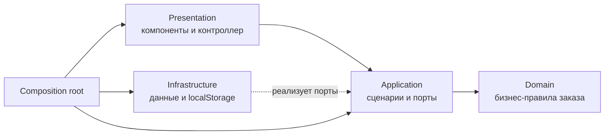

# «Тихий Шум» — сайт кофейни

Адаптивный одностраничный сайт кофейни собственной обжарки. Проект построен на нативных HTML, CSS и JavaScript-модулях, организованных по принципам чистой архитектуры.

[Открыть сайт на GitHub Pages](https://1alex4949031.github.io/silent-place/)


## Возможности

- адаптивный интерфейс для компьютеров, планшетов и телефонов;
- каталог с отдельными вкладками кофе, завтраков и выпечки;
- фотографии для всех позиций меню;
- добавление позиций в предзаказ и изменение количества;
- локальное сохранение корзины между перезагрузками страницы;
- валидация формы предзаказа;
- диалог бронирования столика;
- интерактивная навигация и доступное управление с клавиатуры;
- схема проезда и переход к адресу в Яндекс Картах;
- автоматическая публикация на GitHub Pages после успешных тестов.

## Технологии

- HTML5;
- CSS3: custom properties, Grid, Flexbox, адаптивные медиазапросы;
- JavaScript ES Modules без UI-фреймворков;
- Web Storage API для локального заказа;
- встроенный `node:test` для тестирования бизнес-логики;
- GitHub Actions и GitHub Pages для CI/CD.

В проекте нет runtime-зависимостей и этапа сборки. Браузер получает исходные ES-модули напрямую.

## Быстрый запуск

### Требования

- Node.js 20 или новее;
- pnpm — необязательно, если запускать команды напрямую через Node.js.

### Локальный сервер

```powershell
pnpm start
```

После запуска сайт доступен по адресу `http://127.0.0.1:4173`.

Альтернативный запуск без pnpm:

```powershell
node server.mjs
```

Открывать `index.html` напрямую через `file://` нежелательно: браузеры могут ограничивать импорт ES-модулей. Локальный HTTP-сервер исключает эту проблему.

### Тесты

```powershell
pnpm test
```

или:

```powershell
node --test
```

Тесты покрывают доменную модель заказа, сценарии приложения и реализации репозиториев.

## Структура проекта

```text
silent-place/
├── .github/
│   └── workflows/
│       └── deploy-pages.yml        тестирование и публикация GitHub Pages
├── assets/
│   └── images/                     изображения интерьера и позиций меню
├── docs/
│   ├── architecture.md             дополнительное описание архитектуры
│   └── design-concept.png          визуальная концепция проекта
├── src/
│   ├── app/
│   │   ├── compositionRoot.js      сборка и внедрение зависимостей
│   │   └── main.js                 точка входа браузерного приложения
│   ├── application/
│   │   ├── ports/                  контракты репозиториев
│   │   └── use-cases/              пользовательские сценарии
│   ├── domain/
│   │   └── order/Order.js          сущность заказа и бизнес-правила
│   ├── infrastructure/
│   │   ├── catalog/                источник данных каталога
│   │   └── order/                  хранение заказа в localStorage
│   ├── presentation/
│   │   ├── components/             повторно используемые UI-компоненты
│   │   ├── controllers/            обработка действий пользователя
│   │   ├── presenters/             подготовка данных к отображению
│   │   ├── sections/               секции главной страницы
│   │   ├── styles/                 токены, базовые и адаптивные стили
│   │   └── views/                  композиция страницы
│   └── shared/
│       └── config/menu.js          демонстрационные данные меню
├── tests/                           модульные тесты
├── index.html                       HTML-оболочка приложения
├── server.mjs                       локальный статический сервер
├── package.json                     команды и требования к Node.js
└── pnpm-lock.yaml                   lock-файл пакетного менеджера
```

## Чистая архитектура

Главное правило проекта — зависимости направлены внутрь. Бизнес-логика не знает о DOM, браузерном хранилище и способе доставки данных.



### Domain

`src/domain` содержит независимую бизнес-модель. Сущность `Order` отвечает за:

- добавление и удаление позиции;
- изменение количества;
- расчёт количества товаров и итоговой стоимости;
- преобразование заказа в сериализуемый снимок;
- восстановление корректного состояния из сохранённых данных.

В доменном слое нет обращений к DOM, `localStorage`, HTTP или конкретным компонентам интерфейса.

### Application

`src/application` описывает пользовательские сценарии и контракты внешних систем.

Основные сценарии:

- `GetMenu` — получить меню по категории;
- `GetOrder` — восстановить текущий заказ;
- `AddItemToOrder` — добавить позицию;
- `ChangeOrderQuantity` — изменить количество или удалить позицию;
- `SubmitPreorder` — проверить данные клиента и завершить предзаказ.

В `ports/` находятся абстракции `CatalogRepository` и `OrderRepository`. Сценарии работают с этими контрактами и не зависят от конкретного места хранения.

### Infrastructure

`src/infrastructure` содержит адаптеры внешнего мира:

- `InMemoryCatalogRepository` читает демонстрационное меню из конфигурации;
- `LocalStorageOrderRepository` сохраняет заказ в браузере и использует безопасный fallback в памяти, если Web Storage недоступен.

При подключении backend эти классы можно заменить HTTP-репозиториями, не изменяя доменную модель и интерфейс.

### Presentation

`src/presentation` отвечает только за отображение и взаимодействие:

- components создают шапку, футер, корзину и диалоги;
- sections формируют смысловые блоки страницы;
- presenters переводят данные приложения в безопасную разметку;
- `CafeController` связывает события DOM с прикладными сценариями;
- styles содержат дизайн-токены, компоненты и адаптивные правила;
- `HomePage` собирает страницу из независимых секций.

Конкретные инфраструктурные классы не импортируются в UI.

### App и Composition Root

`src/app/compositionRoot.js` — единственное место, где создаются конкретные репозитории, сценарии, контроллер и представление. Благодаря этому зависимости явно передаются через конструкторы, а реализации можно заменять независимо.

## Поток данных

Пример добавления напитка в предзаказ:

1. Пользователь нажимает кнопку в карточке меню.
2. `CafeController` получает идентификатор позиции.
3. `AddItemToOrder` запрашивает товар через `CatalogRepository`.
4. Доменная сущность `Order` применяет бизнес-правило добавления.
5. `OrderRepository` сохраняет новый снимок заказа.
6. Контроллер повторно получает состояние и обновляет интерфейс через presenter.

UI не изменяет данные напрямую, а инфраструктура не содержит бизнес-решений.

## GitHub Pages

Workflow `.github/workflows/deploy-pages.yml` запускается при push в ветку `master` или вручную из вкладки Actions.

Пайплайн выполняет три этапа:

1. запускает тесты на Node.js 22;
2. формирует статический артефакт только из `index.html`, `src/` и `assets/`;
3. публикует артефакт в окружение `github-pages`.

Так как все пути к ресурсам относительные, сайт корректно работает по адресу проекта `/silent-place/`, а не только в корне домена.

## Ограничения демонстрации

- меню, цены, адрес и часы работы являются демонстрационными;
- предзаказ не отправляется на сервер и хранится только в текущем браузере;
- бронирование имитируется интерфейсом без внешней CRM;
- очистка данных сайта в браузере удалит сохранённый заказ.

## Как подключить настоящий backend

1. Реализовать новые адаптеры `CatalogRepository` и `OrderRepository`, например на базе `fetch`.
2. Подменить реализации в `src/app/compositionRoot.js`.
3. Сохранить существующие сценарии, доменную модель и presentation-слой без изменений.

Подробнее о границах слоёв — в [документации архитектуры](docs/architecture.md).
